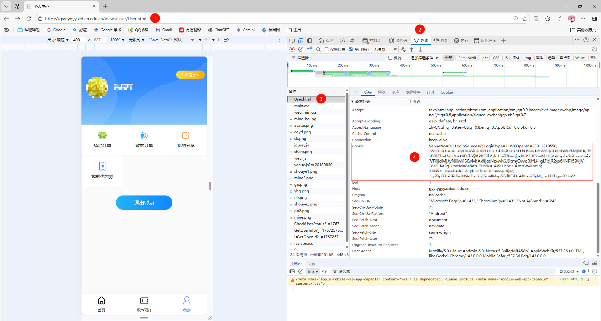

# 西安电子科技大学体育馆预订脚本

## 使用方法

### 获取Cookie

- 浏览器进入网页[https://gyytygyy.xidian.edu.cn/Views/User/User.html](https://gyytygyy.xidian.edu.cn/Views/User/User.html)，
- 打开开发者模式
- 选择`网络`标签页
- 复制Cookie到[config/config.yaml](./config/config.yaml)

